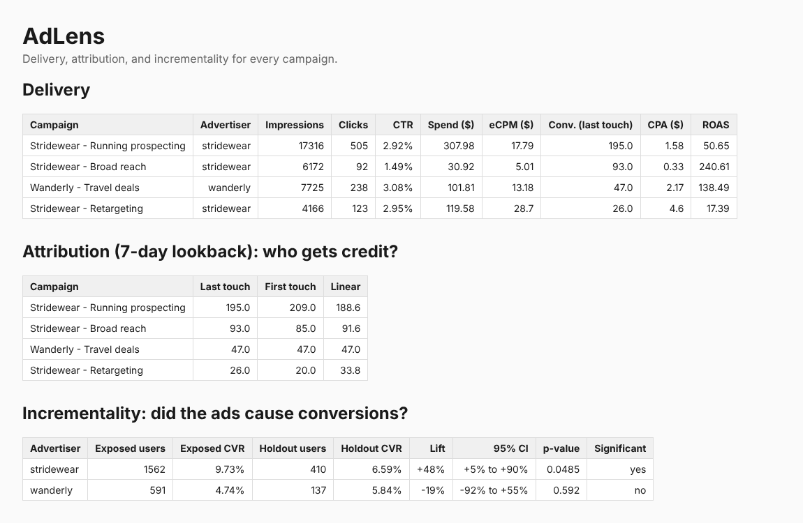

# AdLens: a mini ad server with first-party audiences and measurement

AdLens is a small, working ad-tech stack in Python/FastAPI. It decides which ad to show,
tracks what users do afterwards, builds audiences from that data, and answers the question
advertisers actually care about: **did the ads cause conversions, or would they have happened anyway?**



## What it does

| Piece | What it does | Real-world equivalent |
|---|---|---|
| **Ad server** (`app/ad_server.py`) | Targeting (geo, device, interests), budget checks, frequency caps (max N ads per user per 24h), and a **second-price auction** (the winner pays the runner-up's bid + $0.01) | Google Ad Manager, DSP bidding logic |
| **Tracking** (`app/main.py`) | Impression logging, click redirects, and a 1x1 **conversion pixel** the advertiser's site fires on purchase | Floodlight / Meta Pixel / Google Analytics tags |
| **First-party audiences** (`segments` table) | "Users who clicked a Stridewear ad in the last 14 days", usable for **retargeting** | A DMP / Customer Match audience |
| **Attribution** (`app/measurement.py`) | Splits each conversion's credit across the ads a user saw: **last touch**, **first touch**, **linear** (7-day lookback) | Attribution reports in ad platforms |
| **Incrementality** (`app/measurement.py`) | A per-advertiser **holdout group** never sees that advertiser's ads; we log a "ghost ad" when they *would* have. Compares conversion rates with a **two-proportion z-test** and a 95% confidence interval | Conversion Lift studies |
| **Simulator** (`simulate.py`) | 2,000 synthetic users over 14 days hit the real API. The true ad effect is built in, so we can check whether the measurement recovers it | Data modeling / validating a measurement method |

## The key result

The simulator builds in a known truth:
- **Stridewear's** ads really work: they raise a user's conversion rate **1.6x** (+60%).
- **Wanderly's** ads do **nothing** (1.0x).

| | Attribution says | Lift test says | Truth |
|---|---|---|---|
| Stridewear | 314 conversions credited | **+48% lift**, 95% CI +5% to +90%, significant | +60% |
| Wanderly | 47 conversions credited, ROAS 138x | **-19%**, CI -92% to +55%, not significant | 0% |

**Attribution happily credits Wanderly's ads with 47 conversions and a 138x return, even though
the ads caused none of them**: those users were going to buy anyway. Only the holdout test separates
correlation from causation, and its confidence interval contains the true effect for both advertisers.

## Design decisions

- **Second-price auction**: advertisers can bid what an impression is truly worth to them, since they
  only pay just above the next-best bid. A $5 reserve price stands in for open-market competition.
- **Holdout per advertiser, not per campaign**: if control users could still see another campaign from
  the same advertiser, the control group would be contaminated and lift would be underestimated.
- **Deterministic holdout assignment** (hash of user + advertiser): a user stays in the same group on
  every request, without storing assignments.
- **"Ghost ads"**: we compare exposed users against holdout users who *would have won the auction*,
  not against random users, so both groups have the same targeting and intent.
- **Last touch prefers clicks over impressions**, matching the common industry default.

## Run it

```bash
pip install -r requirements.txt
python -m pytest              # 12 tests: auction, targeting, frequency cap, budget, holdout, segments, attribution, lift, API
python simulate.py            # ~1.5 min; prints lift results and writes dashboard.html
uvicorn app.main:app --reload # live API; open http://127.0.0.1:8000/docs
```

### API

| Endpoint | Purpose |
|---|---|
| `POST /campaigns` | Create a campaign (bid CPM, budget, targeting, frequency cap, holdout %) |
| `POST /segments` | Create a first-party audience |
| `GET /ad?user_id=...&geo=...&device=...&interests=...` | Run the auction and return an ad (204 = no fill) |
| `GET /track/click` | Log a click, return the landing page |
| `GET /track/conversion.gif` | Conversion pixel (returns a 1x1 GIF) |
| `GET /report/campaigns` | Impressions, clicks, CTR, spend, eCPM, CPA, ROAS |
| `GET /report/attribution?model=last_touch\|first_touch\|linear` | Attributed conversions per campaign |
| `GET /report/lift/{advertiser_id}` | Lift, 95% CI, p-value |
| `GET /dashboard` | HTML report |

## Limits and next steps

- SQLite and a single process: fine for a demo. At scale, events would stream through a queue (e.g.
  Pub/Sub or Kafka) into a warehouse (BigQuery), with the auction reading from a cache.
- The lift test has wide intervals at 2,000 users; real studies size the holdout for statistical power
  up front. A power calculator is a natural next step.
- Data-driven attribution (e.g. Shapley values) and budget pacing across the day are not implemented.
